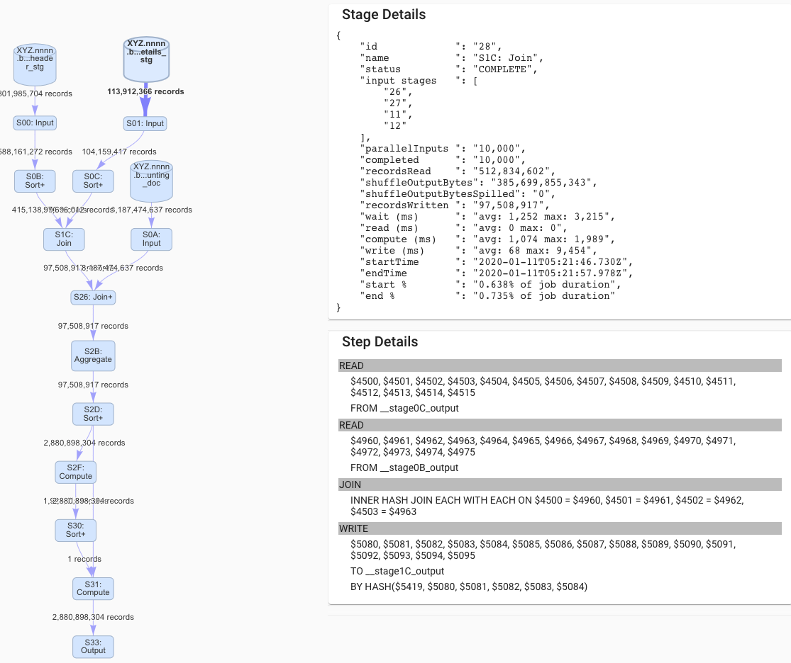

# Welcome to BigQuery Visualiser Documentation

BigQuery Visualiser is a web application to visualise the flow of execution stages within a BigQuery job. This may be useful in identifying problematic stages and provides greater usability for large query plans than the default query plan explanation in the Google Cloud Console.

