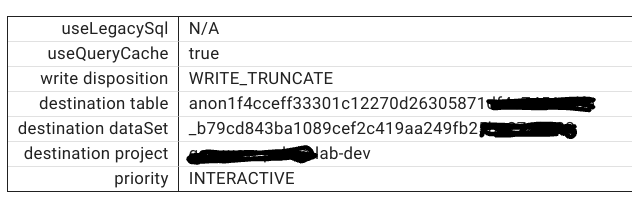

# Overview 
BigQuery Visualiser displays a Bigquery Queryplan document. It has four main tabs:

* Plan Selection
* Query Tree
* Task Gantt Chart
* Progress Charts

### Authentication

The application is able to retrieve query plans directly from BigQuery. 
Prior to doing so it will attempt to authenticate you.

## Downloading Query Plans
On the 'Select Job' tab there are three options:

* Download from Google Cloud
* Retrieve by job id
* Upload from Computer

Under the card with this title:

1. Select a project from the listbox
2. Click on 'List Jobs'
3. Scroll through the list of jobs and click on the Get button of the job you are interested in

If you select the option `list jobs for all users` then you must have owner permission for the selected project.

Enter a job id in the field. The format of the job id must be:
    <projectname>:<location>.<queryid>

Assuming you have previously downloaded the query plan using the `bq show -j --format=prettyjson <job-id>` command to a local file,
click on this card the 'Select File to upload' button, navigate to the file and select it. To start uploading click the
Upload button.

## The Tree Tab

The Tree tab shows the query plan as a directed graph.

* DB icons represent BQ tables
* all other icons represent actual query stages (input, compute, aggregate, etc.)
* clicking on a node displays the stage and step details on the right

All nodes can be selected. On selection the right hand side tabs called 'Stage Details' and 'Step Details' provide in depth information.

## The Timing Tab
The timing Tab displays a Gantt style view to quickly show how long the individual stages take.

## The Progress Tab
There are three time graphs that display progress of the overall job:

* Work Completion Progress
* Estimated Slot Usage
* Estimated Runnable Units

The Work **Completion Progress** shows the work units, broken into three categories:

1. Completed Units
2. Active Units
3. Pending Units

The **Estimated Slot Usage** chart shows how many slots are being consumed over time. 

The **Estimated Runnable Units** chart gives an idea of how much work could be run at any
point in time. 
 When there are insufficient slots available, this graph will max out for extended periods of time.s

## Bottom Section

At the bottom a number of tabs show overall plan information:

* Overview (jobId etc)
* SQL used
* Tables 
* Reservation
* Statistics
* Settings
* Display Options

### Overview

### SQL

###  Tables

### Reservations
Displays the slotMs used across reservations. 

### Statistics

### Settings

---
## Known Limits

The application will only display graphs for queries. Load jobs etc do not result in query stages being output.

The Timing Page will not load if the execution times of jobs are less than 1 second. This is a limitation of the graphing 
package.

If the job was cancelled, the queryplan will not contain timing information. So the GanttChart will display an error.

Clicking the get projects when you are not yet logged in will result in a login process being started instead. Users need to
click on get projects button again after login was successful.

The Number of records transferred displayed for reads from tables can be incorrect if the stage reads from more than one table.
This is a limitation in the Job Details providewd by BQ.

---

